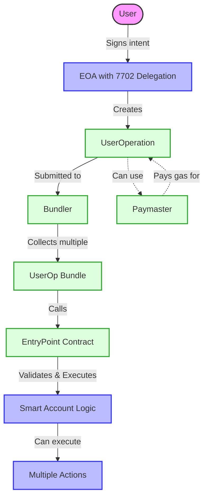
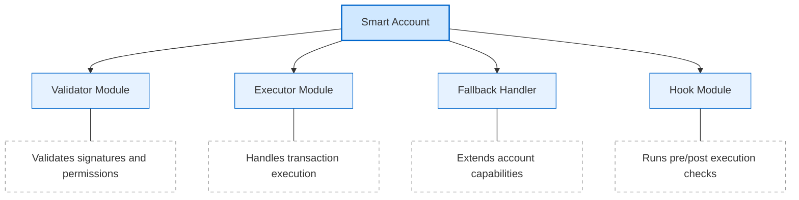
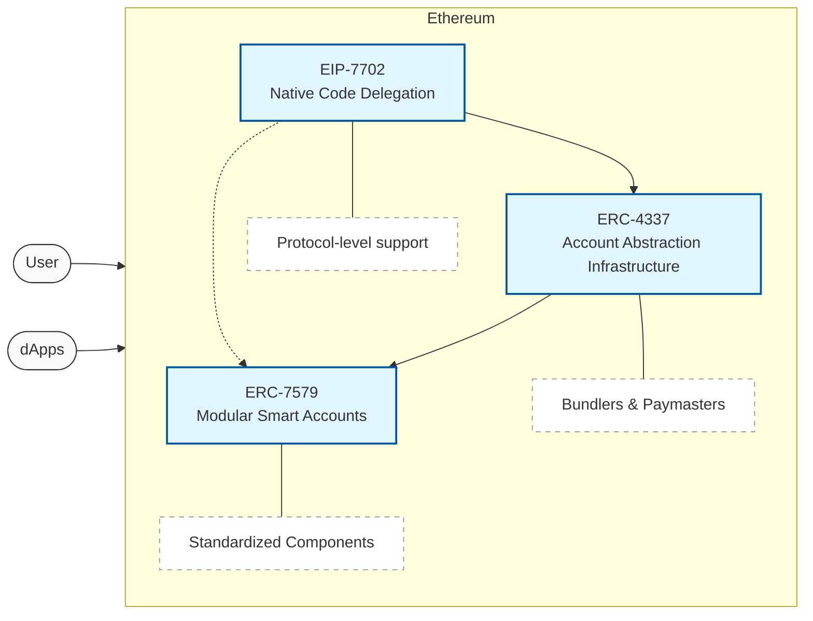
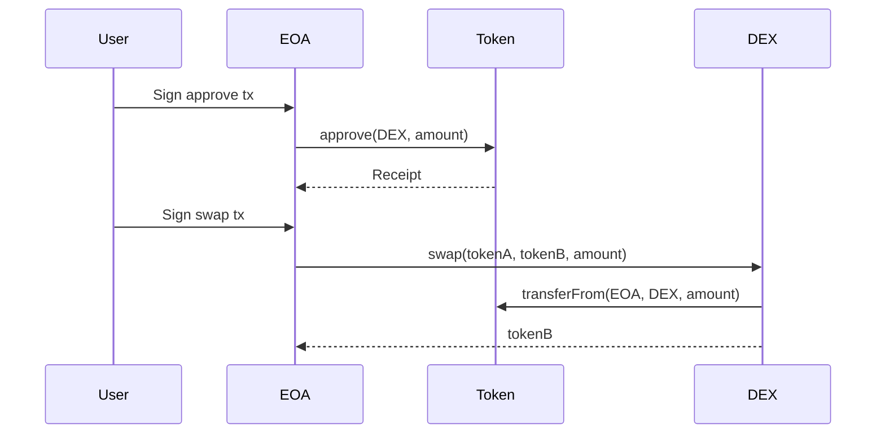
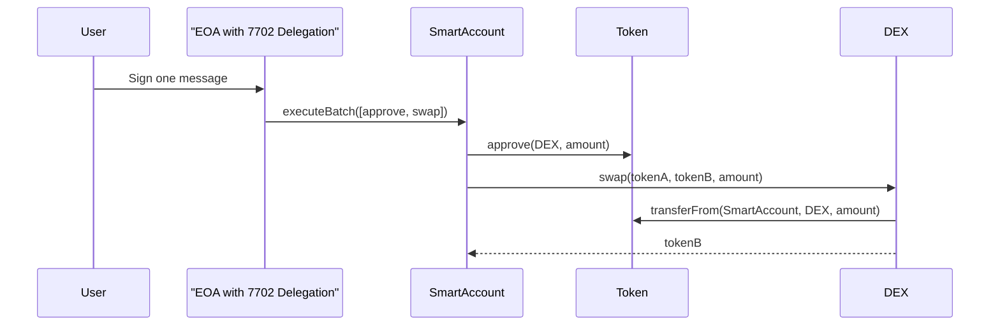
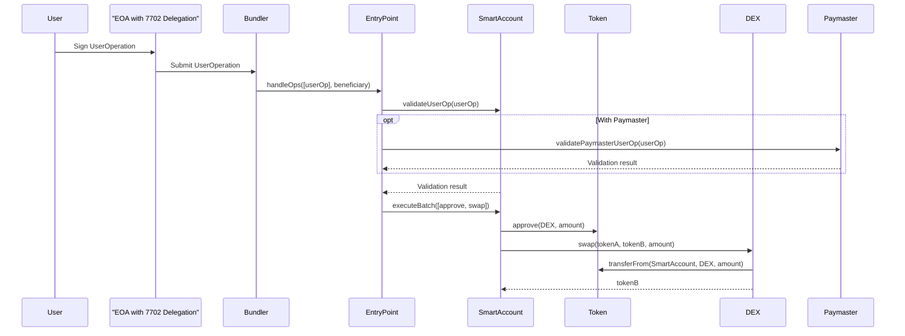

# EIP-7702: Native Code Delegation and the Evolution of Smart Accounts in Ethereum

- [EIP-7702: Native Code Delegation and the Evolution of Smart Accounts in Ethereum](#eip-7702-native-code-delegation-and-the-evolution-of-smart-accounts-in-ethereum)
  - [The Limitations of Traditional EOAs](#the-limitations-of-traditional-eoas)
  - [EIP-7702: Bringing Code Delegation to Ethereum](#eip-7702-bringing-code-delegation-to-ethereum)
    - [The New Transaction Type](#the-new-transaction-type)
    - [Authorization List: The Key Innovation](#authorization-list-the-key-innovation)
    - [How Delegation Actually Works](#how-delegation-actually-works)
    - [Benefits Over Traditional EOAs](#benefits-over-traditional-eoas)
  - [ERC-4337: The Infrastructure Layer](#erc-4337-the-infrastructure-layer)
    - [UserOperations: The Alternative Transaction Format](#useroperations-the-alternative-transaction-format)
    - [EntryPoint: The Central Hub](#entrypoint-the-central-hub)
    - [Bundlers: Transaction Collectors](#bundlers-transaction-collectors)
    - [Paymasters: Gas Abstraction](#paymasters-gas-abstraction)
    - [How EIP-7702 and ERC-4337 Work Together](#how-eip-7702-and-erc-4337-work-together)
  - [ERC-7579: The Modular Future](#erc-7579-the-modular-future)
    - [The Power of Modularity](#the-power-of-modularity)
    - [Core Module Types](#core-module-types)
    - [Integration with EIP-7702](#integration-with-eip-7702)
  - [The Complete Smart Account Ecosystem](#the-complete-smart-account-ecosystem)
  - [Practical Implementation: A Simple EIP-7702 Account](#practical-implementation-a-simple-eip-7702-account)
  - [Comparing Transaction Flows](#comparing-transaction-flows)
    - [Traditional EOA Approach](#traditional-eoa-approach)
    - [EIP-7702 Native Approach](#eip-7702-native-approach)
    - [ERC-4337 Infrastructure with EIP-7702](#erc-4337-infrastructure-with-eip-7702)
  - [Conclusion: A Complete Smart Account Ecosystem](#conclusion-a-complete-smart-account-ecosystem)
  - [References](#references)
    - [Standards \& Specifications](#standards--specifications)
    - [Official Documentation \& Resources](#official-documentation--resources)
    - [Development Tools \& SDKs](#development-tools--sdks)
    - [Reference Implementations](#reference-implementations)
    - [Testing \& Deployment](#testing--deployment)
    - [Registries \& Metrics](#registries--metrics)
    - [Educational Content](#educational-content)
      - [Video Resources](#video-resources)
      - [Articles \& Guides](#articles--guides)

The journey toward better Ethereum accounts has been a long one. EOAs (Externally Owned Accounts) have served as the primary way users interact with the blockchain since Ethereum's launch, but their limitations become increasingly apparent as the ecosystem matures.

This article explores how EIP-7702's native code delegation creates a foundation for better user experiences, and how it fits into the broader smart account ecosystem alongside ERC-4337 and ERC-7579.

## The Limitations of Traditional EOAs

EOAs work well as simple blockchain identities but fall short when users need more sophisticated functionality:

- **No batch transactions**: Every operation requires a separate signed transaction
- **Limited security models**: Only private key access, no built-in multisig or social recovery
- **Gas payment restrictions**: Must pay gas in ETH, not other tokens
- **All-or-nothing permissions**: No granular control over what applications can do
- **No programmability**: Cannot customize account behavior through code

These limitations have driven the development of smart contract wallets. However, using smart contract wallets traditionally required a separate EOA to control them, maintaining the underlying problem. The standards we'll discuss aim to solve this challenge in complementary ways.

## EIP-7702: Bringing Code Delegation to Ethereum

EIP-7702 introduces a fundamental capability to Ethereum: the ability for an EOA to delegate its execution to smart contract code without requiring protocol changes to the entire account model.

### The New Transaction Type

At its core, EIP-7702 adds a new transaction type (0x04) called the "set code transaction." This allows an account to designate a smart contract whose code will be executed whenever the account is called.

Here's the structure of this new transaction type:

```
Set Code Transaction (0x04) = rlp([
  chain_id,                // Network ID (e.g. 1 = Mainnet)
  nonce,                   // Transaction count for the account
  max_priority_fee_per_gas,// Tip for block producer
  max_fee_per_gas,         // Max fee including base + tip
  gas_limit,               // Max gas for this tx
  destination,             // Target address (contract or EOA)
  value,                   // ETH to transfer (in wei)
  data,                    // Calldata (empty for ETH transfers)
  access_list,             // List of accessed addresses/storage keys
  authorization_list,      // NEW: Code delegations signed off-chain
  signature_y_parity,      // 0 or 1, part of ECDSA
  signature_r,             // ECDSA r
  signature_s              // ECDSA s
])
```

### Authorization List: The Key Innovation

The major addition is the `authorization_list`, which contains entries that specify which smart contract code should be executed:

```
authorization_list = [[
  chain_id,   // Network ID where the code lives
  address,    // Smart contract address to delegate execution to
  nonce,      // Per-delegation nonce to prevent replay
  
  y_parity,   // Signature components that authorize
  r,          // this delegation from the
  s           // account owner
], ...]
```

This enables a "delegation designator" (0xef0100 || address) to be written to the account's code field, telling the Ethereum protocol: "When someone calls this account, execute the code at this address instead."

### How Delegation Actually Works

When an EIP-7702 transaction is processed:

1. The account's code field is set to `0xef0100 || address`
2. Future transactions to this account are redirected to execute the code at `address`
3. The original account maintains its address and balance
4. The account's nonce continues to increment normally

This effectively upgrades an EOA to have smart contract functionality without changing its address or requiring a new account.

### Benefits Over Traditional EOAs

EIP-7702 enables several key capabilities:

**1. Batched Transactions**

Before EIP-7702, an approval and swap required two separate transactions:

```
Tx1: Approve token spending
Wait for confirmation...
Tx2: Execute swap
```

With EIP-7702:

```
Single message: Smart account handles both operations in one atomic transaction
```

**2. Sponsored Transactions**

Apps can cover gas costs for users without complex infrastructure, making onboarding seamless.

**3. Privilege De-escalation**

Users can create limited permissions for specific actions:

```solidity
// Smart account validation can enforce spending limits
function validate(bytes calldata signature, bytes32 intentHash) public view returns (bool) {
    (address target, bytes memory data, uint256 value) = decodeIntent(intentHash);
    
    if (isTokenTransfer(target, data)) {
        // Enforce daily limits
        require(getTransferAmount(data) <= dailyLimit, "Exceeds limit");
    }
    
    return isValidSignature(intentHash, signature);
}
```

**4. Feature Comparison**

| Feature | Traditional EOA | EIP-7702 Account |
|---------|----------------|------------------|
| Multiple operations in one tx | ❌ | ✅ |
| Custom security rules | ❌ | ✅ |
| Sponsored transactions | ❌ | ✅ |
| Account recovery options | ❌ | ✅ |
| Session keys | ❌ | ✅ |
| Automatic actions | ❌ | ✅ |

EIP-7702 provides a native approach to account abstraction - but it doesn't exist in isolation. Let's explore how it connects with the broader ecosystem.

## ERC-4337: The Infrastructure Layer

While EIP-7702 provides the foundation for native code delegation, ERC-4337 complements it by offering infrastructure that works today, even on networks without EIP-7702 support.

ERC-4337 introduces several key components:

### UserOperations: The Alternative Transaction Format

Instead of traditional transactions, smart accounts use UserOperations:

```solidity
// From lib/account-abstraction-v0.8.0/contracts/interfaces/PackedUserOperation.sol
struct PackedUserOperation {
    address sender;                // The sender account of this request
    uint256 nonce;                 // Unique value the sender uses to verify it is not a replay
    bytes initCode;                // If set, the account contract will be created by this constructor
    bytes callData;                // The method call to execute on this account
    bytes32 accountGasLimits;      // Packed gas limits for validateUserOp and callData method call
    uint256 preVerificationGas;    // Gas not calculated by the handleOps method, but added to the gas paid
    bytes32 gasFees;               // Packed gas fields maxPriorityFeePerGas and maxFeePerGas
    bytes paymasterAndData;        // If set, contains paymaster address, verification gas limit, postOp gas limit and extra data
    bytes signature;               // Sender-verified signature over the entire request
}
```

### EntryPoint: The Central Hub

The EntryPoint contract processes all UserOperations:

```solidity
// From lib/account-abstraction-v0.8.0/contracts/interfaces/IEntryPoint.sol
// Simplified EntryPoint interface
interface IEntryPoint is IStakeManager, INonceManager {
    // Execute a batch of UserOperations
    function handleOps(
        PackedUserOperation[] calldata ops,
        address payable beneficiary
    ) external;
    
    // Execute a batch of UserOperation with Aggregators
    function handleAggregatedOps(
        UserOpsPerAggregator[] calldata opsPerAggregator,
        address payable beneficiary
    ) external;
    
    // Generate a request Id - unique identifier for this request
    function getUserOpHash(
        PackedUserOperation calldata userOp
    ) external view returns (bytes32);
    
    // Additional methods omitted for brevity...
}
```

### Bundlers: Transaction Collectors

Bundlers collect UserOperations, package them, and submit them to the blockchain.

### Paymasters: Gas Abstraction

Paymasters can sponsor gas fees for users or allow payment in tokens other than ETH:

```solidity
// From lib/account-abstraction-v0.8.0/contracts/interfaces/IPaymaster.sol
interface IPaymaster {
    enum PostOpMode {
        // User op succeeded
        opSucceeded,
        // User op reverted. Still has to pay for gas
        opReverted,
        // Only used internally in the EntryPoint (cleanup after postOp reverts)
        postOpReverted
    }

    function validatePaymasterUserOp(
        PackedUserOperation calldata userOp,
        bytes32 userOpHash,
        uint256 maxCost
    ) external returns (bytes memory context, uint256 validationData);
    
    function postOp(
        PostOpMode mode,
        bytes calldata context,
        uint256 actualGasCost,
        uint256 actualUserOpFeePerGas
    ) external;
}
```

### How EIP-7702 and ERC-4337 Work Together

The magic happens when these standards combine:



An EIP-7702 account can create a UserOperation that leverages the entire ERC-4337 infrastructure:

```javascript
// UserOperation for an EIP-7702 account
const userOp = {
    sender: "0xMyEIP7702Account",
    nonce: await entryPoint.getNonce(account, 0),
    factory: "0x7702", // Special flag for EIP-7702 accounts
    factoryData: "0x",
    callData: encodeFunctionCall("executeBatch", [operations]),
    // Additional parameters...
    signature: sign(userOpHash, privateKey)
};
```

This means EIP-7702 accounts can benefit from:

- Bundling of operations from multiple users
- Gas payment through paymasters
- Alternative mempools for UserOperations
- The entire ERC-4337 ecosystem

The advantages of this combination are significant:

1. **Native performance** when using direct transactions
2. **Enhanced features** when using the bundler infrastructure
3. **Flexibility** to choose the most appropriate approach for each use case

## ERC-7579: The Modular Future

If EIP-7702 provides native delegation and ERC-4337 offers infrastructure, ERC-7579 completes the picture by standardizing how smart accounts can be built in a modular way.

### The Power of Modularity

ERC-7579 introduces a modular architecture where different components (modules) can be added, removed, or upgraded independently:



### Core Module Types

ERC-7579 defines four primary module types:

1. **Validator Modules (type id: 1)**
   - Verify signatures and permissions
   - Implement authentication logic
   - Determine if a transaction should execute

2. **Executor Modules (type id: 2)**
   - Handle transaction execution
   - Enable specialized execution flows
   - Optimize for specific use cases

3. **Fallback Handler Modules (type id: 3)**
   - Add functionality not in the core account
   - Process unknown function calls
   - Extend the account's capabilities

4. **Hook Modules (type id: 4)**
   - Run before and after transactions
   - Enforce spending limits or security checks
   - Monitor account activity

### Integration with EIP-7702

An EOA using EIP-7702 can delegate to a modular smart account:

```solidity
// Modular smart account implementation for EIP-7702
contract ModularSmartAccount is IERC7579Execution, IERC7579AccountConfig, IERC7579ModuleConfig {
    // Implementation of required interfaces
    
    function validateUserOp(
        PackedUserOperation calldata userOp,
        bytes32 userOpHash,
        uint256 missingAccountFunds
    ) external returns (uint256) {
        // Forward to appropriate validator module
    }
    
    // Other required functions...
}
```

This allows EIP-7702 accounts to benefit from the modular architecture while maintaining their native properties.

## The Complete Smart Account Ecosystem

Together, these three standards create a comprehensive ecosystem for smart accounts:

1. **EIP-7702** provides native delegation and protocol-level support
2. **ERC-4337** offers infrastructure for bundling and gas abstraction
3. **ERC-7579** standardizes modular account architecture

The relationship between them can be visualized as follows:



## Practical Implementation: A Simple EIP-7702 Account

Let's look at a [simple implementation of an EIP-7702 account](https://github.com/eth-infinitism/account-abstraction/blob/4cbc06072cdc19fd60f285c5997f4f7f57a588de/contracts/accounts/Simple7702Account.sol):

```solidity
// From lib/account-abstraction-v0.8.0/contracts/accounts/Simple7702Account.sol
contract Simple7702Account is BaseAccount, IERC165, IERC1271, ERC1155Holder, ERC721Holder {

    // Address of entryPoint v0.8
    function entryPoint() public pure override returns (IEntryPoint) {
        return IEntryPoint(0x4337084D9E255Ff0702461CF8895CE9E3b5Ff108);
    }

    /**
     * Make this account callable through ERC-4337 EntryPoint.
     * The UserOperation should be signed by this account's private key.
     */
    function _validateSignature(
        PackedUserOperation calldata userOp,
        bytes32 userOpHash
    ) internal virtual override returns (uint256 validationData) {
        return _checkSignature(userOpHash, userOp.signature) ? 
               SIG_VALIDATION_SUCCESS : SIG_VALIDATION_FAILED;
    }

    function isValidSignature(bytes32 hash, bytes memory signature) public view returns (bytes4 magicValue) {
        return _checkSignature(hash, signature) ? 
               this.isValidSignature.selector : bytes4(0xffffffff);
    }

    function _checkSignature(bytes32 hash, bytes memory signature) internal view returns (bool) {
        return ECDSA.recover(hash, signature) == address(this);
    }

    function _requireForExecute() internal view virtual override {
        require(
            msg.sender == address(this) ||
            msg.sender == address(entryPoint()),
            "not from self or EntryPoint"
        );
    }

    // Support for various interfaces
    function supportsInterface(bytes4 id) public override(ERC1155Holder, IERC165) pure returns (bool) {
        return
            id == type(IERC165).interfaceId ||
            id == type(IAccount).interfaceId ||
            id == type(IERC1271).interfaceId ||
            id == type(IERC1155Receiver).interfaceId ||
            id == type(IERC721Receiver).interfaceId;
    }

    // Accept incoming calls (with or without value), to mimic an EOA
    fallback() external payable {}
    receive() external payable {}
}
```

This simple implementation allows an EOA to:

1. Delegate to a smart contract via EIP-7702
2. Validate signatures based on the original EOA
3. Execute batched operations
4. Integrate with ERC-4337 infrastructure

## Comparing Transaction Flows

Let's compare the flow of a simple "approve and swap" operation across different approaches:

### Traditional EOA Approach



### EIP-7702 Native Approach



### ERC-4337 Infrastructure with EIP-7702



## Conclusion: A Complete Smart Account Ecosystem

The combination of EIP-7702, ERC-4337, and ERC-7579 creates a comprehensive ecosystem for smart accounts that addresses the limitations of traditional EOAs while maintaining security and flexibility.

EIP-7702 provides the native foundation, enabling accounts to delegate execution to smart contract code without changing addresses. ERC-4337 builds the supporting infrastructure with bundlers, paymasters, and the EntryPoint contract. ERC-7579 standardizes how these accounts can be built in a modular, upgradeable way.

Together, these standards represent a significant evolution in how users interact with Ethereum:

- **Better UX**: Users can perform complex operations in single transactions
- **Enhanced security**: Custom validation logic reduces the risk of fund loss
- **Greater flexibility**: Accounts can evolve with changing needs
- **Lower barriers**: Sponsored transactions make onboarding seamless
- **Developer innovation**: Standardized interfaces enable an ecosystem of components

For developers looking to implement these standards:

1. Start with EIP-7702 for native delegation capabilities
2. Leverage ERC-4337 infrastructure for additional features
3. Design with ERC-7579 modularity for future-proof solutions

The future of Ethereum accounts is smart, modular, and user-centric, bringing us closer to mainstream blockchain adoption by enhancing the capabilities that users have come to expect from modern financial systems.

## References

### Standards & Specifications

- [EIP-7702: Native Code Delegation](https://eips.ethereum.org/EIPS/eip-7702) - Standard for delegating execution to other smart contracts.
- [EIP-4337: Account Abstraction](https://eips.ethereum.org/EIPS/eip-4337) - User operation standard for smart accounts without protocol changes.
- [ERC-7579: Modular Smart Accounts](https://eips.ethereum.org/EIPS/eip-7579) - Standard for smart accounts with modular functionality.
- [ERC-7780: Keystore-Managed Validation Operations](https://eips.ethereum.org/EIPS/eip-7780) - Standard for handling validation operations managed by keystores.
- [ERC-7739: Readable Typed Signatures](https://ethereum-magicians.org/t/erc-7739-readable-typed-signatures-for-smart-accounts/20513) - Proposal for human-readable typed signatures for smart accounts.

### Official Documentation & Resources

- [EIP-7702 Documentation](https://eip7702.io/) - Official documentation for the Native Code Delegation standard.
- [EIP-4337 Documentation](https://www.erc4337.io/) - Official resources for the Account Abstraction standard.
- [ERC-7579 Documentation](https://erc7579.com/) - Official site for the Modular Smart Accounts standard.
- [ERC-7579 Architecture by Safe](https://docs.safe.global/advanced/erc-7579/7579-safe) - Detailed explanation of the 7579 architecture by the Safe team.
- [ERC-7579 vs ERC-6900](https://docs.zerodev.app/blog/who-when-what) - Comparison explaining the differences and why 7579 was adopted.
- [EntryPoint v0.8.0](https://docs.google.com/document/d/1w3xB_B1PUYRDnnCXSsLZXQVerjiw0_72NxvQwhdrWeU/edit?usp=sharing) - Detailed documentation for the EntryPoint contract with native 7702 support.

### Development Tools & SDKs

- [viem](https://viem.sh/) - TypeScript library for interacting with Ethereum.
- [permissionless.js](https://github.com/pimlicolabs/permissionless.js) - TypeScript utilities built on viem for ERC-4337 account abstraction.
- [Module SDK](https://github.com/rhinestonewtf/module-sdk) - SDK for developing modules compatible with ERC-7579.
- [Smart Sessions SDK](https://github.com/rhinestonewtf/module-sdk/blob/main/src/module/smart-sessions) - Tools for implementing session-based authentication.
- [ModuleKit](https://docs.rhinestone.wtf/modulekit) - Comprehensive toolkit for module developers by Rhinestone.
- [ERC-7579 Compatible SDK](https://erc7579.com/tooling) - Official tooling for building with the ERC-7579 standard.

### Reference Implementations

- [ERC-4337 Reference Implementation](https://github.com/eth-infinitism/account-abstraction) - Official reference implementation for Account Abstraction.
- [ERC-7579 Reference Implementation](https://github.com/erc7579/erc7579-implementation) - Reference code for implementing the Modular Smart Accounts standard.
- [Smart Sessions Contracts](https://github.com/erc7579/smartsessions/blob/main/contracts/SmartSession.sol) - Implementation of session-based authentication contracts.

### Testing & Deployment

- [Prool](https://github.com/wevm/prool) - Toolkit for setting up testing infrastructure.
- [Kernel Deployments Status](https://kernel-deployments-status.onrender.com/) - Current deployment status for Kernel implementations.
- [Module Deployment Guide](https://docs.rhinestone.wtf/build-modules/deploying/deployment) - Documentation on how to deploy modules.

### Registries & Metrics

- [ERC-7579 Module Registry](https://github.com/rhinestonewtf/registry/) - Official registry of compatible modules.
- [Account Abstraction Stats](https://www.bundlebear.com/overview/all) - Analytics and metrics for account abstraction usage.
- [Module Ideas Repository](https://rhinestone.notion.site/Module-ideas-for-developer-inspo-338100a2c99540f490472b8aa839da11) - Collection of ideas for ERC-7579 modules.

### Educational Content

#### Video Resources

- [Account Abstraction Video Series](https://www.youtube.com/watch?v=Vpk_MhY-EeE&list=PLMj8NvODurfE9yPZ2beXSjuEgVtVcY1a6) - Comprehensive video tutorials on account abstraction.
- [EIP-7702 Talk by Authors](https://www.youtube.com/watch?v=_k5fKlKBWV4) - Explanation of EIP-7702 by its core contributors.
- [Smart Sessions Explained](https://www.youtube.com/watch?v=GeYbDsOW4hQ) - Detailed walkthrough of session-based authentication models.

#### Articles & Guides

- [What Are Smart Sessions?](https://docs.rhinestone.wtf/module-sdk/using-modules/smart-sessions) - Explanation of session keys and their implementation.
- [Safe Modular Smart Account Architecture Explained](https://safe.global/blog/safe-modular-smart-account-architecture-explained) - Comprehensive breakdown of modular account design.
