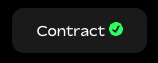

Step 3: Deploy Blended Contracts
---

This guide is based off of the template blended application in this [Github repo](https://github.com/fluentlabs-xyz/blended-template-foundry-cli).


Now that both Solidity and Rust contracts have been created and compiled, the next step is to deploy (and verify) them.

## 3.1 Deploy the Rust Contract with gblend

First you'll deploy the Rust contract (**the order matters!**):

```shell
gblend create RustTypesTest.wasm \
    --rpc-url https://rpc.testnet.fluent.xyz \
    --private-key $PRIVATE_KEY \
    --broadcast \
    --verify \
    --wasm \
    --verifier blockscout \
    --verifier-url https://testnet.fluentscan.xyz/api/
```

Be sure to capture the address the contract is deployed to and save it somewhere.

Note that you'll need to add your private key as environment variable in a `.env` file and then run `source .env`.

:::danger

Never use private keys linked to accounts with real funds, always use development wallets!

:::

## 3.2 Deploy the Solidity Contract

Now you can deploy the Solidity contract. As mentioned above, the order matters because you'll need the address of the deployed Rust contract (`RustTypesTest.wasm`).

```bash
gblend create src/FluentSolRustTypesTest.sol:FluentSolRustTypesTest \
    --rpc-url https://rpc.testnet.fluent.xyz \
    --private-key $PRIVATE_KEY \
    --broadcast \
    --constructor-args <RustTypesTestAddress> \
    --verify \
    --verifier blockscout \
    --verifier-url https://testnet.fluentscan.xyz/api/
```

## 3.3 Check with Block Explorer

Go to the [Fluent testnet block explorer](https://testnet.fluentscan.xyz) and look for the contract address the contracts were deployed to.

### Check Verification Status

The deployment commands up top, `gblend create`, included additional arguments to verify the contracts immediately on deployment. To check if the contracts did indeed get verified, find the contract at its address, and navigate to the _Contract_ tab. It should have a green checkmark next to its name if the verification was successful.



:::info[Patience is a virtue]

Note that it may take up to 3 minutes to verify the contract, this is not out of the ordinary so don't send new requests too frequently.

:::

_Did the contract verification fail?_

Try again with these commands:

```bash
# WASM contract verification
gblend verify-contract <RustTypesTestAddress> RustTypesTest.wasm \
    --wasm \
    --verifier blockscout \
    --verifier-url https://testnet.fluentscan.xyz/api/
```

```bash
# Solidity contract verification
gblend verify-contract <FluentSolRustTypesTestAddress> FluentSolRustTypesTest \
    --verifier blockscout \
    --verifier-url https://testnet.fluentscan.xyz/api/ \
    --constructor-args <RustTypesTestAddress>
```

If this still does not solve the issue, check out the [troubleshooting guide](../../gblend/troubleshooting.md#wasm-contract-verification-fails).

### Read the Solidity function return values

With the Solidity contract verified on Blockscout, we are now able to test 
the Solidity and Rust contract Blended App. With the verified Solidity contract on Blockscout, go to:

```
Contract > Read/Write contract > Read
```

and click on the different function names. You should see values that match the correct type for that function name, confirming your Blended App is setup between Solidity and Rust. 🎉

## Next Up

While Fluentscan's web interface is good for quick testing, you'll likely want to interact with your blended application from some client environment. The last step in this guide explains how to integrate it using libraries like ethers.js.
