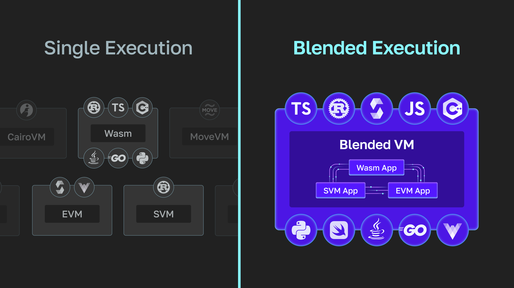
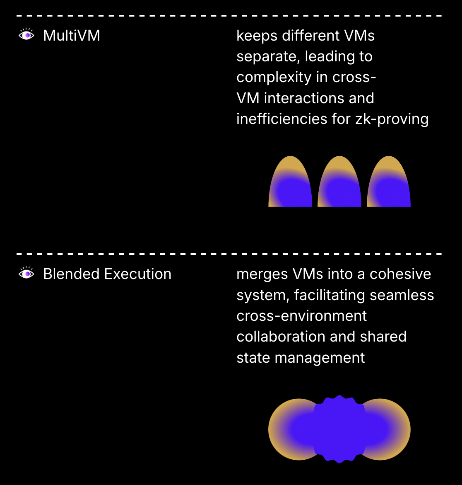
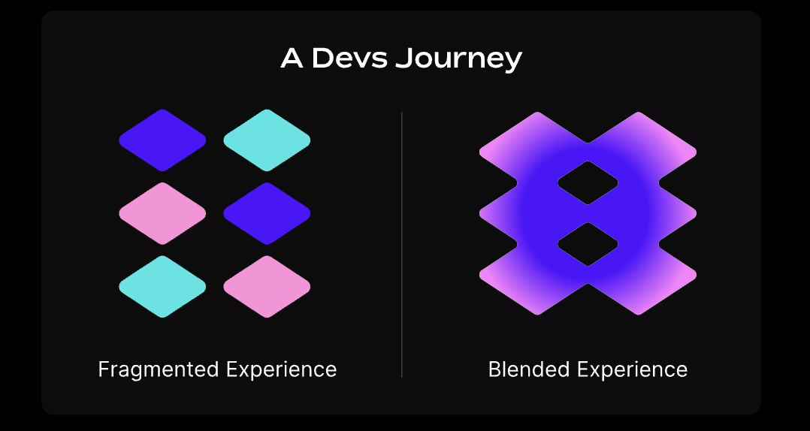

Blended Execution
---

## What is blended execution?

Blended execution allows programs written for different virtual machines (VMs) to work together within a unified execution environment. Smart contracts, programming languages and tools built for disparate VMs share the same blockchain state, allowing them to communicate seamlessly. This results in real-time, atomic composability between these otherwise isolated paradigms, making it possible for developers to create cohesive applications, leveraging multiple programming languages and tools without compatibility concerns. It also enables existing apps built for different VMs to benefit from combined network effects and shared liquidity.

:::tip The upside?

Users can interact with apps across a blended execution network without needing to bridge or switch wallets.

:::

## How does Fluent support blended execution?

On Fluent, functionalities of the EVM, SVM, and Wasm are _blended_ together at the execution layer. This is achieved through rWasm—a low-level intermediate representation (IR) which serves as [Fluent’s VM](fluent-overview.md#the-fluent-vm). rWasm is effectively a state verification function responsible for representing every operation within the Fluent execution layer. Fluent simulates the behaviors of the EVM, SVM, and Wasm, which are compiled down to rWasm for execution. This ensures compatibility and smooth interaction across these diverse systems and is optimal from a zk-proving standpoint, as only one state transition (as opposed to multiple, as with multiVM solutions) is ultimately proven. Fluent’s blended design is also extensible - with the potential to represent additional VMs with dedicated AOT/JIT compilers.

## What is an altVM

An _altVM_ (alternative virtual machine) generally refers to a VM that serves as an alternative to the EVM, which is the most widely used VM for executing smart contracts. AltVMs can support different execution environments, architectures, or technologies that are not inherently compatible with the EVM. AltVMs often aim to provide different functionalities or efficiencies, such as supporting multiple programming languages, improved performance, or lower costs for executing smart contracts. Examples include Wasm-based VMs, which enable developers to write contracts in languages like Rust, Go, or C++, and the MoveVM for its formal verification security properties. In the context of blockchain systems, altVMs enhance the flexibility and expressivity of decentralized applications by allowing developers to use a broader range of development tools and programming paradigms compared to the traditional EVM.

## Blended execution vs multiVM

**MultiVM** is a type of _altVM_ that uses multiple, separate virtual machines within the same network. Each VM operates independently, and caters to different programming languages or execution environments. Maintaining separate VMs introduces complexity, particularly when it comes to state synchronization and cross-VM interactions.This can lead to a fragmented developer and user experience, as interactions across environments require additional coordination.

**Blended Execution**, on the other hand, is a more integrated approach compared to multiVM. Instead of maintaining separate VMs that interact, Blended Execution brings different VMs together into a unified execution environment. This allows multiple VMs to share the same state and execute seamlessly within the same framework. It is also optimal from a zk-proving standpoint, as only one state transition is ultimately proven. In essence, the main difference lies at the integration level.

## What is a blended app?

A blended app is an app that operates within a blended environment and takes full advantage of the unique ability to use multiple VM targets, such as the EVM and Wasm, within a single, unified framework.

:::tip How does it benefit devs?

This enables developers to write different parts of an application in the language and execution environment best suited to each component, resulting in better performance, flexibility, and usability.

:::

