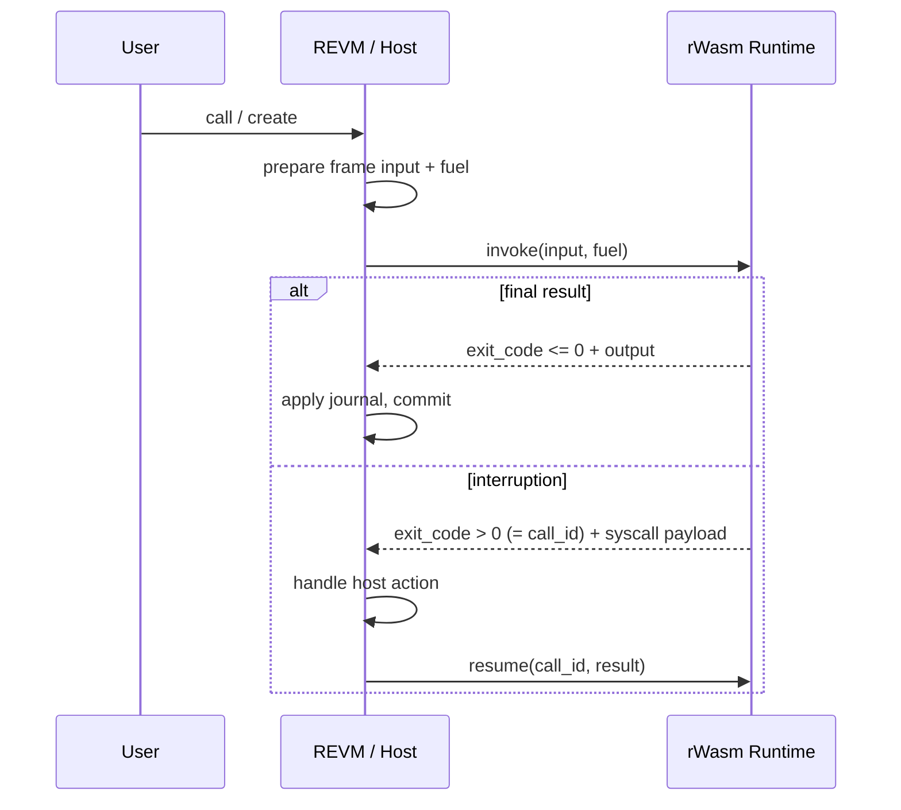

Fluent doesn't execute every contract with a single uniform engine. A transaction routes through REVM, REVM picks the runtime that should run the logic, and from that point REVM coordinates every state change that runtime makes. That's how EVM, Wasm, the Universal Token runtime, and future additions like SVM all live behind one commit model.

This page walks through what that looks like during a normal call.

## The components in play

Five pieces of the execution layer do the heavy lifting inside a running node:

- **REVM integration layer** — frame setup, the journal of tentative state changes, and the host side of every syscall.
- **Runtime executor** — runs rWasm modules in either **contract mode** (isolated, strict bounds, user contracts) or **system mode** (cached compiled executors, structured outputs, protocol-owned runtimes) and tracks the resumable context interruption uses.
- **Interruptible EVM runtime** — the delegated runtime contract that executes EVM bytecode inside Fluent, itself running under rWasm.
- **SDK and runtime-context layer** — contract-facing APIs and the structured envelope handling that system runtimes use to report side effects back to the host.
- **Shared types and constants** — syscall indexes, address maps, runtime limits, gas and fuel constants, wire structs. These define the protocol-level contract between runtime and host.

Every concrete behavior on this page comes out of how those pieces interact. The other pages in this section zoom in on each one.

## The normal call lifecycle

A transaction lands on the node, REVM invokes the runtime, and the flow goes:

1. REVM prepares the frame: input bytes, caller, value, context flags, a fuel budget derived from remaining gas.
2. It invokes the runtime with that input and fuel limit.
3. The runtime returns either a final result or an interruption request. The distinction is in the exit code: `<= 0` is a final status (success, revert, or an error class); `> 0` is an interruption, and its numeric value is the runtime's `call_id` — a handle into a saved execution context.
4. On a final result, REVM maps the exit code into an instruction result and applies the journal.
5. On an interruption, the host performs the requested operation — a storage read, a nested call, a metadata update, whatever the runtime asked for — then resumes the runtime with the answer, the fuel accounting delta, and any returned data.
6. The journal commits only when a frame completes successfully.

Step 3 is the choke point. Every privileged operation in the system funnels through the same protocol, and that's what lets one state machine host multiple runtimes safely: each runtime is a deterministic function that yields to the host for anything it shouldn't do on its own.

## Two execution modes

Not every runtime is treated the same. The executor runs in one of two modes, and the choice affects everything from how fuel is metered to how side effects are transported.

**Contract mode** runs untrusted user contracts. The execution context is isolated, all bounds and fuel are strictly enforced, and nothing about the call assumes privilege. Every ordinary Solidity or Rust contract takes this path.

**System mode** is reserved for the small set of runtimes the protocol itself ships: the delegated EVM runtime, the delegated Wasm runtime, the Universal Token runtime, the runtime-upgrade precompile, the fee manager, the bridge. These get cached compiled executors (the runtime stays hot, not recompiled per call) and produce **structured output envelopes** instead of opaque return buffers.

Mode selection is address-based: if the callee belongs to the system-runtime set defined in shared constants, the executor runs in system mode. Otherwise, contract mode.

## Structured envelopes

System runtimes need to say more than "here are my return bytes." One system call might need to report storage diffs, emitted logs, metadata transitions, and the outcome of a nested frame — all in a form the host can apply deterministically. The envelope contract is what gets that across the runtime-host boundary without ambiguity.

There are three envelope shapes, one per lifecycle point:

- **New-frame input envelope** — how a system runtime describes a new frame it wants the host to create (target, value, input, call kind).
- **Interruption outcome envelope** — the payload the host produces for the runtime to consume after a privileged action.
- **Final execution outcome envelope** — what a completed system call produces: return value, storage diff, logs, metadata updates, and the frame's final status.

Contract-mode calls don't use envelopes. Their return path is a plain bytes buffer; state changes are journal entries the host writes during interruption handling.

:::info
Envelope decoding is part of the consensus surface. A malformed envelope or a misinterpreted field can commit wrong side effects. Changing envelope shapes is a protocol change, not a refactor.
:::

## The address map is part of consensus

One subtlety: the set of addresses that triggers system mode is fixed in shared constants. That set includes the delegated runtime owners for each supported VM family (EVM, Wasm, SVM, Universal Token) and the protocol-owned contracts that run under privilege — runtime upgrade, fee manager, bridge, and so on.

Changing this map changes routing. Adding an address pulls a new runtime into the privileged set; removing one breaks every deployment that relied on it. That's why the address map is versioned at the protocol level and never modified as an incidental change.
