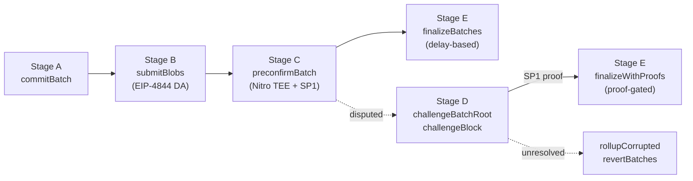

Fluent is an Ethereum-aligned L2 rollup. Every block produced on Fluent eventually settles to Ethereum under a cryptographic integrity story, and the way that story is composed — fast preconfirmation plus slow cryptographic adjudication — is what makes the chain usable and safe at the same time.

This page describes the verification pipeline at the protocol level: how batches are committed, how data is made available, how execution is preconfirmed, how disputes are resolved, and how the system halts itself when something breaks. Running a node isn't covered here; see the node runbook in the upstream `fluentbase/docs`.

## Shared state, execution-agnostic settlement

Blended execution — EVM, Wasm, and (soon) SVM contracts sharing one state machine — is documented in [Blended 101](../knowledge-base/blended-101.md). What matters for settlement is that Fluent verifies rollup commitments over **block headers and data roots**, not over VM-specific execution traces. Adding a new execution environment doesn't change what the rollup proves; it changes what fits into a block the rollup already knows how to settle.

Each batch is a sequential record identified by a root, a block span, a declared block count, an expected blob count, and timing windows for each phase. Verification parameters are frozen per batch at commit time, so retroactive governance edits can't change the security conditions of an in-flight batch.

## Not pure optimistic, not pure validity

Two well-known models sit on either side of what Fluent does.

**Optimistic rollups** accept state transitions on the assumption that they're correct and rely on economic challenges to catch faults within a dispute window. They're cheap and fast in the happy path, but the dispute window dominates user-perceived finality.

**Validity (ZK) rollups** require a succinct proof for every state transition before accepting it. Security is purely cryptographic at the transition level, but proving cost and latency are non-trivial, and prover decentralization is a hard open problem.

Fluent is an **optimistic-ZK hybrid**. Commitments and data publication are fast. A TEE-based preconfirmation gives users rapid execution attestations. Challenges are economically bonded and resolved with SP1-backed proofs. Finalization has two modes: delay-based by default, proof-gated when block commitments are already proven. Users experience optimistic throughput; adversarial operation gets cryptographic adjudication.

## The five-stage verification pipeline

### Stage A — Batch commitment

The sequencer commits a batch by calling `commitBatch` with:

- the batch root,
- block-span continuity — `fromBlockHash` of the first block and `toBlockHash` of the last,
- the declared number of blocks,
- the expected blob count,
- deposit-consumption metadata.

The contract enforces continuity across batches: the previous batch's `toBlockHash` must match the new batch's `fromBlockHash`. It records the block at which the commit happened, snapshots all timing windows in effect, and anchors the bridge sent-message cursor (`sentMessageCursorStart`) so an emergency revert has a deterministic rollback target.

### Stage B — Blob publication and DA binding

`submitBlobs` records EIP-4844 versioned blob hashes using the `blobhash` opcode. Blobs can be posted incrementally, but the batch only transitions from **Committed** to **Submitted** when the total submitted hash count equals the `expectedBlobs` value declared at commit time.

The effect is a strong data-availability binding: on-chain adjudication is keyed to immutable blob hashes. Compression and serialization happen off-chain, but every downstream step — preconfirmation, challenge, resolution — is parameterized by the exact blob hash vector stored on-chain. Data published to the L1 blob store is what the protocol adjudicates over, and nothing else.

### Stage C — TEE preconfirmation

`preconfirmBatch` accepts a signature over `(chain id, verifier contract, batch root, blob hash list)` from a whitelisted AWS Nitro enclave. The Nitro verifier contract runs a two-phase filter on admitted signing keys:

- **Attestation phase.** The enclave-derived public key is admitted only after an SP1 proof verifies the enclave's attestation. Public outputs of that proof include the pubkey and an attestation timestamp, and a bounded freshness window stops stale attestations from being replayed.
- **Batch-signature phase.** Only attested public keys are allowed to authorize batch signatures. The whitelist is maintained by governance; keys can be rotated or revoked.

Fluent doesn't accept an arbitrary attester key. A key has to pass attestation verification before it's admitted, and the attestation is cryptographically bound to the expected enclave image measurement (PCR0) via the SP1 proof.

### PCR0-bound key verification

A critical detail: the enclave's signing identity isn't trusted on submission. The attestation pipeline verifies a statement whose public outputs include the enclave-derived pubkey and the attestation timestamp, and the SP1 proof is checked against the attestation program key before the pubkey is admitted for batch-signature checks. The sequence:

1. The enclave session generates a signing identity.
2. Attestation evidence binds that identity to the expected enclave measurement context.
3. SP1 verification validates the attestation statement on-chain.
4. Only then is the pubkey accepted for batch-signature use.

If an enclave image is modified outside the expected measurement, the attestation proof fails validation under the configured verification key, and the signer is never admitted. Preconfirmation signatures are grounded in a measured enclave context, not in an arbitrary off-chain key registration.

### Stage D — Challenge and ZK resolution

Fluent exposes two dispute objects:

- `challengeBatchRoot` — disputes the batch root itself.
- `challengeBlock` — disputes a specific block inside a batch.

Both require the exact challenger deposit and must arrive within challenge-window deadlines derived from the per-batch snapshots recorded at commit time. A challenged batch transitions to **Challenged**. For block-level disputes, commitments are verified against the committed batch Merkle root; for batch-root disputes, linkage to the previous batch's tail block is checked.

Resolution uses proof-backed validation:

- `resolveBlockChallenge` verifies the SP1 proof against the challenged block, its header, and the batch's blob hash context.
- `resolveBatchRootChallenge` verifies block-header chain consistency and recomputed batch-root agreement.

Economic flows are explicit: when a prover successfully resolves a challenge, the challenger's deposit transfers to the prover. In emergency-revert paths, challengers can be refunded with configured incentive fees.

:::info
Challenge initiation is currently role-gated — only specific operational participants can open disputes. This is a temporary trust configuration. The target end-state is permissionless challenge access where any qualified participant can trigger dispute resolution under the same proof rules.
:::

### Stage E — Finalization modes

Two finalization paths exist, and which one applies depends on what's happened to the batch:

- **`finalizeBatches`** (delay-based) — the default. A batch finalizes once preconfirmation is done and the configured `finalizationDelay` has elapsed without an unresolved challenge.
- **`finalizeWithProofs`** (proof-gated) — accelerated. A batch can finalize as soon as all of its block commitments have been cryptographically proven, without waiting for the delay.

Normal operation is throughput-oriented via delay-based finalization; adversarial operation is proof-oriented via proof-gated acceleration. Nothing requires every block to carry a proof up front. Proofs are produced when they're needed — to resolve disputes or to skip the delay window.

## Corruption detection and safety halt

Fluent treats certain protocol violations as reasons to stop making forward progress. The `_rollupCorrupted` state is a first-class safety gate, and it fires when either:

- the bridge's deposit-liveness indicator shows the oldest unconsumed message has expired, or
- the oldest non-finalized batch exceeds the deadline of its current phase (blob submission, preconfirmation, or challenge resolution).

Once corrupted, privileged emergency flow can call `revertBatches` to undo non-finalized batches, rewind the bridge consumption cursor, clean challenge and proof state, and re-open safe progress from a deterministic index. The design explicitly favors safety over liveness: if invariants have been violated, the chain halts state-changing progress until operators intervene.

## Roles and trust model

Fluent's rollup is operated by a set of explicit roles, each with a scoped responsibility:

- `SEQUENCER` — orders transactions and commits batches.
- `PRECONFIRMATION` — produces TEE-backed preconfirmation signatures.
- `CHALLENGER` — initiates disputes (currently role-gated; target end-state is permissionless).
- `PROVER` — produces SP1 proofs to resolve disputes and to gate fast finalization.
- `EMERGENCY` — can trigger revert flows under the corruption conditions above.
- `admin` / upgrader — governs the contract set itself.

"No centralized override over the state transition function" is not the same as "zero trust." Fluent reduces unilateral-override risk by combining immutable batch and data commitments, bonded adversarial participation in challenges, cryptographic proof verification for disputed transitions, and explicit role separation — but governance and role-based trust in upgrade and emergency controls remain part of the model. The accurate framing is **structured, compartmentalized trust with cryptographic fault containment**, not trustlessness.

## Economic framing

The pipeline is designed to exploit cheap data availability (EIP-4844 blobs) while keeping dispute-grade verification available on demand. In steady state, marginal transaction cost is low because expensive proof generation is shifted to adversarial or accelerated paths rather than required for every block up front.

From a systems perspective, Fluent aims for a Pareto surface:

- **optimistic throughput and low UX latency** in normal operation,
- **cryptographic recoverability and challenge enforceability** under fault,
- **deterministic rollback** when safety invariants are violated.

For users, this is a rollup that feels fast in the happy path and audits cleanly under pressure. For protocol engineers, it's a template for composing TEE liveness with ZK correctness without collapsing into pure trust on one side or pure proving on the other.
